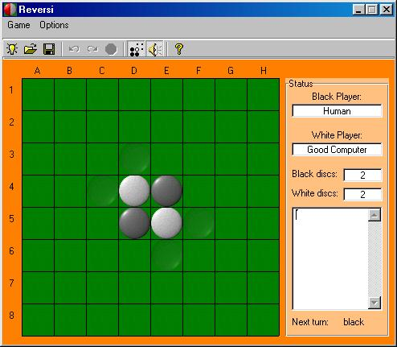



## Reversi 2\.0 \(updated version\): A reversi \(othello\) game with AI

### Description

This Game uses alpha-beta search to play reversi (othello), it has five levels of computer intelligence and the highest level plays really well (better than the previous version). The game also has some more features like: save/load position, setup position, undo/redo, sound,...
 
### More Info
 

             |
---                |---
**Submitted On**   |2003-08-22 13:18:42
**By**             |[sohaib farsakh](https://github.com/Planet-Source-Code/PSCIndex/blob/master/ByAuthor/sohaib-farsakh.md)
**Level**          |Intermediate
**User Rating**    |5.0 (25 globes from 5 users)
**Compatibility**  |VB 6\.0
**Category**       |[Games](https://github.com/Planet-Source-Code/PSCIndex/blob/master/ByCategory/games__1-38.md)
**World**          |[Visual Basic](https://github.com/Planet-Source-Code/PSCIndex/blob/master/ByWorld/visual-basic.md)
**Archive File**   |[Reversi\_2\_184867252005\.zip](https://github.com/Planet-Source-Code/sohaib-farsakh-reversi-2-0-updated-version-a-reversi-othello-game-with-ai__1-58711/archive/master.zip)

